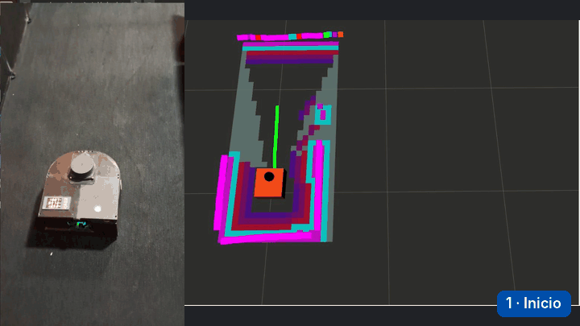

# Robot explorador

Guía abierta sobre el trabajo de titulación **"Navegación y exploración autónoma de interiores utilizando un robot móvil de tracción diferencial"**, de Sebastián Valderas Neculqueo, con el profesor guía Patricio Galarce Acevedo. Ingeniería Civil Electrónica, Universidad Tecnológica Metropolitana (UTEM), 2026.

**Sitio:** https://svn11x.github.io/tesis_explain/



## Qué es

Un robot de bajo costo, con ROS 2, que entra a un recinto que no conoce, lo recorre solo y dibuja su plano. La guía explica cada parte del trabajo como un artículo de divulgación técnica: la idea, los argumentos, la evidencia medida, los límites y los casos del mundo real donde se usa lo mismo. Cada afirmación lleva su fuente numerada.

Está pensada para cuatro tipos de lectores:

1. Quien quiere entender la idea en diez minutos, sin conocimientos previos.
2. Quien estudia ingeniería o robótica y quiere el detalle de cada capa, con sus fuentes.
3. Quien quiere construir uno, con materiales, versiones y lecciones de taller.
4. Quien va a exponer o evaluar el trabajo y necesita el argumento completo con su respaldo.

## Contenido

La guía tiene diez temas en tres bloques y tres páginas complementarias.

| Página | Bloque | Tema |
|---|---|---|
| `index.html` | | Portada, video del robot, el ciclo en cuatro pasos, temas, cifras, casos reales y rutas de lectura |
| `problema.html` | El contexto | Qué es la autonomía en interiores, el estado del arte y cada decisión frente a sus alternativas |
| `robot.html` | El contexto | Piezas, energía, red, reparto entre Arduino, Raspberry Pi y computador, ROS 2 y costo |
| `movimiento.html` | Cómo funciona | Tracción diferencial, encoders, odometría y los ensayos de recta y giro |
| `control.html` | Cómo funciona | PID en tiempo discreto, la ley heredada que opera como PI, windup y sintonía con FOPDT y PSO |
| `mapeo.html` | Cómo funciona | LiDAR 2D, SLAM Toolbox, cierre de lazo, resultados de mapeo y privacidad |
| `navegacion.html` | Cómo funciona | Mapas de costos, inflación, A estrella, DWB, árbol de comportamiento y recuperaciones |
| `exploracion.html` | Cómo funciona | Exploración por fronteras y por qué 53 de 54 metas abortadas fueron reemplazos |
| `gemelo.html` | Cómo funciona | El modelo en Gazebo Classic, la brecha con la realidad y qué se compara con qué |
| `resultados.html` | Evidencia y práctica | Verificar frente a validar, los cuatro objetivos, limitaciones y trabajo futuro |
| `replicar.html` | Evidencia y práctica | Materiales, conexiones, versiones, repositorios base y videos para aprender |
| `mundo-real.html` | Complemento | Doce casos reales, de una aspiradora a la mina El Teniente y a Marte |
| `lecciones.html` | Complemento | Diez lecciones de ingeniería que la tesis deja implícitas |
| `recursos.html` | Complemento | Material para aprender, videos, glosario, bibliografía, fuentes externas y cómo citar |

`preguntas.html` solo redirige a `lecciones.html`. Las respuestas que tenía se integraron a los temas.

Cada tema sigue la misma estructura:

1. Un encabezado con una figura de la tesis o una foto del prototipo.
2. **En pocas palabras**, con la idea central y sus cifras clave.
3. Secciones con argumentos, figuras ampliables, animaciones, comparadores y simuladores.
4. **En el mundo real**, con casos donde se usa la misma idea.
5. **Fuentes de esta página**, numeradas. Al pasar sobre un número se ve la fuente sin salir del texto.

## Criterios del contenido

1. Las cifras y figuras del robot salen de la tesis y se citan con su sección, tabla o figura.
2. Las fuentes externas se marcan por tipo (artículo, documentación, prensa, video) y se reúnen en `recursos.html`.
3. Los interactivos llevan una etiqueta: **Datos de la tesis** cuando muestran mediciones, **Interactivo** o **Ilustrativo** cuando usan datos de ejemplo para explicar una idea.
4. Lo que no se midió se dice de forma explícita.
5. El texto evita el punto y coma y las rayas como separadores, y explica cada término técnico la primera vez que aparece. Los términos subrayados con puntos muestran su definición al pasar el cursor o al tocarlos.

## Estructura de archivos

```
├── *.html               páginas del sitio, contenido estático para buscadores
├── css/estilo.css       diseño, tema claro y oscuro, impresión
├── js/sitio.js          cabecera, menú, pie, índice lateral, buscador, citas, glosario emergente,
│                        comparadores, videos en bucle, ampliación de imágenes
├── js/sims.js           simulaciones en canvas (exploración, cinemática, encoder, lidar, PID, PSO, inflación, DWB)
├── js/vis1.js           interactivos de mapeo, A estrella, fronteras y metas
├── js/vis2.js           interactivos del firmware, el control y la sintonía
├── js/vis3.js           interactivos de odometría, arquitectura, costos y gemelo digital
├── js/comun.js          utilidades compartidas
├── datos/indice.js      índice del buscador, generado
├── herramientas/indice.py  regenera el índice del buscador
├── herramientas/pruebas_unitarias.js   pruebas sin navegador
├── herramientas/pruebas_navegador.py   pruebas en Chromium con Playwright
└── img/
    ├── fotos/           prototipo, recinto, componentes y plataformas comerciales
    ├── tesis/           figuras de la tesis, animaciones en MP4 y sus portadas
    └── miniaturas/      imágenes de las tarjetas de cada tema
```

No hay dependencias ni paso de compilación. Todo es HTML, CSS y JavaScript sin librerías.

## Cómo editar

**Temas.** La lista vive en `CAPS`, al inicio de `js/sitio.js`. De ahí salen el menú, el pie, el número de cada tema y la navegación anterior y siguiente. Las páginas complementarias están en `EXTRAS`.

**Texto.** Cada página es HTML estático y se edita directamente. Después de cambiar texto, regenera el buscador:

```bash
pip install beautifulsoup4
python3 herramientas/indice.py
```

El script indexa todo el texto de cada sección, incluidas tablas, listas y el texto alternativo de los interactivos. Las secciones largas se dividen en partes solapadas con el mismo enlace. Solo el extracto que se muestra en pantalla se recorta, en `js/sitio.js`. El script se detiene con un error si algún enlace del índice apunta a una página o a un ancla que no existe. Sube `datos/indice.js` junto con las páginas.

El buscador no distingue tildes ni mayúsculas, une los miles escritos con espacio y acepta punto o coma decimal: `3.63` y `3,63` encuentran lo mismo, igual que `49 683` y `49683`. Un número debe coincidir completo, así que `3,63` no aparece dentro de `13,63`.

**Citas.** Dentro del texto, una cita es `<a class="ref" href="#f3">3</a>` y apunta al elemento `<li id="f3">` de la lista de fuentes al final de la misma página.

**Términos del glosario.** `<span class="term" data-def="Definición corta.">término</span>` muestra la definición al pasar el cursor, al enfocarlo con teclado o al tocarlo.

**Imágenes.** Se guardan en `.webp` con respaldo `.jpg` o `.png`, con un ancho de 900 a 1600 px. Las figuras grandes tienen una versión `-med` para la página y la original en `data-grande`, que se abre al hacer clic. Cada imagen lleva texto alternativo y una leyenda con su figura en la tesis.

**Animaciones.** Se usan videos MP4 cortos en bucle en lugar de GIF, porque pesan diez veces menos. Se pausan solos si el sistema pide movimiento reducido y tienen un botón para detenerlos.

**Comparador.** Un bloque `.deslizar` con dos imágenes del mismo tamaño muestra un antes y después con una barra que se arrastra o se mueve con las flechas del teclado.

**Interactivos.** Un elemento con `data-vis="nombre"` se monta cuando entra en pantalla, usando la función registrada en `window.VISUALES.nombre`.

**PDF de la tesis.** Cuando la tesis esté publicada, pon su enlace en `TESIS_PDF` dentro de `js/sitio.js` y aparecerá en el pie y en la tabla de `recursos.html#materiales`. Usa solo una dirección verificada, como la del repositorio institucional.

**Materiales originales.** `recursos.html#materiales` dice qué archivos de la tesis están publicados y cuáles faltan. Si publicas el código, las configuraciones o los registros del robot, actualiza esa tabla y enlázalos allí. Los repositorios de `replicar.html#repositorios` son proyectos base, no los archivos usados en la tesis.

## Pruebas

```bash
node herramientas/pruebas_unitarias.js          # geometría de la huella y reloj de paso fijo
pip install playwright beautifulsoup4 && python3 -m playwright install chromium
python3 -m http.server 8765 &
python3 herramientas/pruebas_navegador.py       # páginas, enlaces, buscador, definiciones y simuladores
```

Las pruebas del navegador recorren las 15 páginas en escritorio, móvil y con movimiento reducido, y comprueban errores de consola, interactivos montados, desborde horizontal, enlaces internos, anclas y recursos locales. También prueban el buscador, las definiciones con ratón, toque y teclado, y los simuladores de inflación, DWB, exploración y encoder.

## Ver el sitio en tu computador

```bash
python3 -m http.server 8000
```

Luego abre http://localhost:8000

## Publicar en GitHub Pages

En Settings, Pages, elige "Deploy from a branch", rama `main` y carpeta `/ (root)`. Los cambios quedan publicados uno o dos minutos después de cada commit en `main`.

Para actualizar la publicación existente:

```bash
git pull
# copia o edita los archivos, regenera el índice si cambió texto
python3 herramientas/indice.py
git add -A
git commit -m "Describe el cambio"
git push origin main
```

Después revisa la pestaña Actions del repositorio hasta que el despliegue de Pages termine en verde, y recarga el sitio forzando la caché (Ctrl+Shift+R o Cmd+Shift+R). Las carpetas `herramientas/` y los archivos de prueba no afectan al sitio publicado.

## Accesibilidad

El sitio respeta el modo oscuro del sistema y la preferencia de movimiento reducido, se puede recorrer con teclado y tiene un enlace para saltar al contenido. Con movimiento reducido, las animaciones y simuladores parten detenidos y ofrecen un botón para reproducirlos. Los simuladores que se arrastran, LiDAR, inflación y DWB, también se controlan con deslizadores etiquetados y con las flechas cuando el dibujo tiene el foco. Las definiciones se abren con clic, toque, Enter o Espacio y se cierran con un segundo clic, Escape o un clic fuera. El buscador se abre con la tecla `/`. Cada interactivo tiene un texto que explica lo que muestra, y los videos de YouTube y Vimeo se cargan solo cuando se presiona reproducir.

## Cómo citar

Valderas Neculqueo, S. (2026). *Navegación y exploración autónoma de interiores utilizando un robot móvil de tracción diferencial* [Trabajo de titulación para optar al título de Ingeniero Civil Electrónico]. Universidad Tecnológica Metropolitana.

En `recursos.html#citar` está también el formato BibTeX.

## Créditos de imágenes

Las fotos del prototipo, el recinto y las figuras técnicas son del autor y provienen de la tesis. Las imágenes de productos de terceros, como el RPLidar A1, el router GL.iNet, el Husky A300 y el LoCoBot, son de sus fabricantes y se usan para identificar los equipos. El detalle está en `recursos.html#creditos`.
